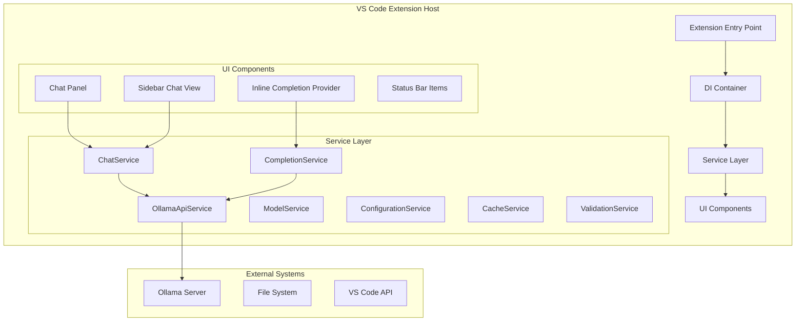
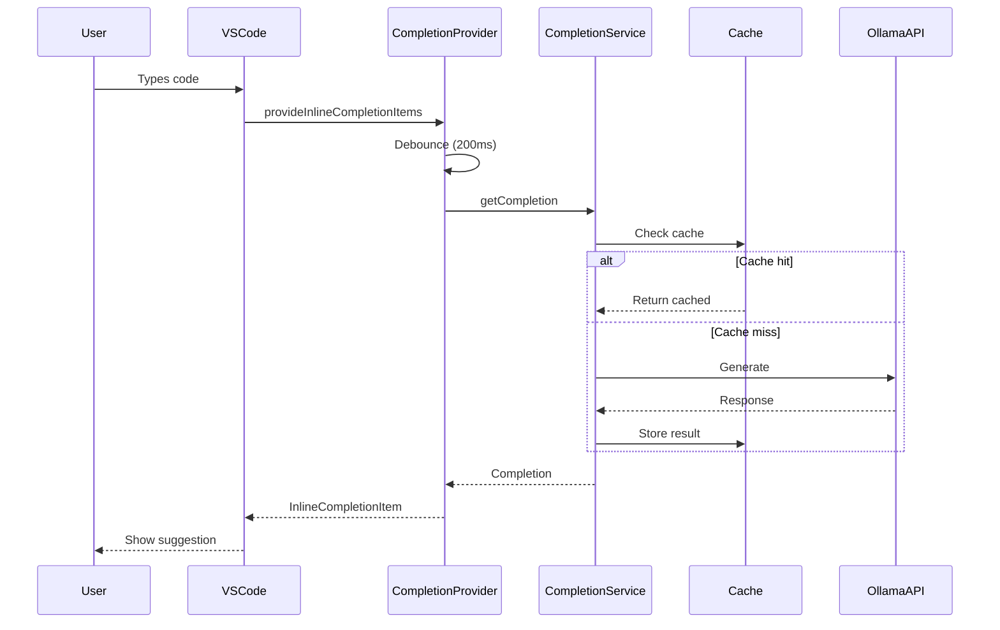
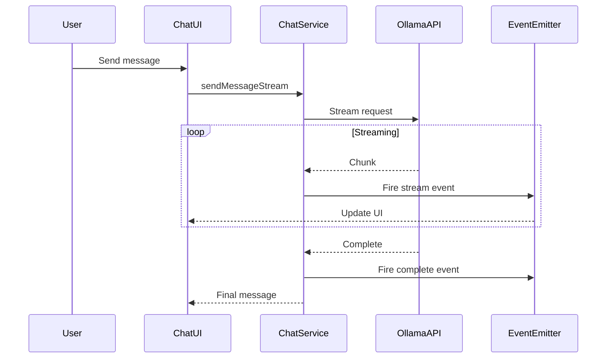

# Ollama Dev Companion Architecture

## Overview

Ollama Dev Companion is a VS Code extension that provides AI-powered code completion and chat functionality using local Ollama models. The extension follows a clean architecture pattern with dependency injection, service interfaces, and strict separation of concerns.

## Architecture Diagram



## Core Design Patterns

### 1. Dependency Injection (DI)

The extension uses a custom DI container for managing service lifecycles and dependencies.

```typescript
// Service registration
container.registerSingleton(
  SERVICE_IDENTIFIERS.IChatService,
  () => new ChatService(apiService, fileService, modelService)
);

// Service resolution
const chatService = container.resolve<IChatService>(
  SERVICE_IDENTIFIERS.IChatService
);
```

**Benefits:**
- Testability through interface-based design
- Loose coupling between components
- Easy service substitution
- Lifecycle management (singleton, transient, scoped)

### 2. Service Pattern

All major functionality is encapsulated in services with well-defined interfaces:

```typescript
interface IChatService {
  createSession(options: ChatOptions): Promise<ChatSession>;
  sendMessage(sessionId: string, message: string): Promise<ChatMessage>;
  // ...
}
```

### 3. Factory Pattern

Complex UI components are created through factories:

```typescript
const chatPanelFactory = createChatPanelFactory(container);
const panel = chatPanelFactory.createOrShow(extensionUri);
```

### 4. Observer Pattern

Event-driven communication using VS Code's EventEmitter:

```typescript
chatService.onChatEvent((event) => {
  if (event.type === 'message') {
    updateUI(event.data);
  }
});
```

## Component Architecture

### Extension Entry Point (`extension.ts`)

- Activates the extension
- Creates and configures the DI container
- Registers all services
- Sets up command handlers
- Manages extension lifecycle

### Service Container (`ServiceContainer.ts`)

Custom dependency injection container supporting:
- Service registration with identifiers
- Lifecycle management (singleton, transient)
- Circular dependency detection
- Disposal pattern implementation
- Type-safe resolution

### Service Layer

#### OllamaApiService
- **Purpose**: Low-level communication with Ollama server
- **Responsibilities**:
  - HTTP request handling
  - Model listing
  - Generation requests
  - Chat API integration
  - Streaming support

#### ChatService
- **Purpose**: High-level chat session management
- **Dependencies**: OllamaApiService, FileService, ModelService
- **Features**:
  - Session lifecycle management
  - Message history
  - Context file integration
  - Event notifications
  - Import/export functionality

#### CompletionService
- **Purpose**: Code completion logic
- **Dependencies**: OllamaApiService, ModelService, CacheService
- **Features**:
  - Prompt generation
  - Response caching with LRU
  - Statistics tracking
  - Configurable behavior

#### ModelService
- **Purpose**: Model selection and management
- **Features**:
  - Available model listing
  - Default model persistence
  - Model change events

#### CacheService
- **Purpose**: Generic caching functionality
- **Implementation**: Uses OptimizedLRUCache internally
- **Features**:
  - Multiple eviction policies (LRU, LFU, FIFO)
  - TTL support
  - Memory limits
  - Statistics

#### ConfigurationService
- **Purpose**: VS Code configuration management
- **Features**:
  - Type-safe configuration access
  - Change notifications
  - Default value handling
  - Validation

### UI Layer

#### Inline Completion Provider
- **Purpose**: Real-time code suggestions
- **Implementation**:
  - Debounced requests (200ms)
  - Context-aware prompts
  - Response cleaning
  - Caching

#### Chat Panel
- **Purpose**: Standalone chat interface
- **Architecture**:
  - Webview-based UI
  - Message passing protocol
  - Theme integration
  - State persistence

#### Sidebar Chat View
- **Purpose**: Integrated chat in sidebar
- **Features**:
  - Multiple sessions
  - Quick access
  - Workspace integration

## Data Flow

### Code Completion Flow



### Chat Message Flow



## Security Architecture

### Input Validation
- All user inputs validated through ValidationService
- Path traversal prevention
- Command injection protection
- Size limits enforcement

### Secure File Access
- SecureFileAccessService validates all file operations
- Workspace boundary enforcement
- Symbolic link resolution
- Access logging

### Content Security Policy
- Strict CSP for webviews
- Nonce-based script execution
- No inline scripts
- Resource loading restrictions

## Performance Optimizations

### Caching Strategy
- **LRU Cache**: O(1) operations using doubly-linked list + hashmap
- **TTL Support**: Automatic expiration
- **Memory Limits**: Prevents unbounded growth
- **Statistics**: Hit/miss tracking

### Debouncing
- Inline completions: 200ms debounce
- Configuration changes: Batched updates
- File watchers: Throttled events

### Resource Management
- Automatic disposal pattern
- Memory monitoring with alerts
- Garbage collection triggers
- Resource pooling for webviews

## Error Handling

### Hierarchical Error Types
```typescript
ValidationError → Network/API errors
NetworkError → Timeout errors  
TimeoutError → Cancellation
CancellationError → User initiated
```

### Recovery Strategies
- Automatic retry with exponential backoff
- Graceful degradation
- User-friendly error messages
- Error event propagation

## Testing Architecture

### Unit Testing
- Service isolation through DI
- Mock implementations
- Interface-based testing

### Integration Testing
- VS Code test framework
- Extension host testing
- Webview testing

### Test Organization
```
src/test/
├── unit/           # Unit tests
├── integration/    # Integration tests
├── mocks/          # Mock implementations
└── fixtures/       # Test data
```

## Configuration

### Settings Schema
```json
{
  "ollama.apiHost": "http://localhost:11434",
  "ollama.defaultModel": "llama2",
  "ollama.enableInlineCompletion": true,
  "ollama.completion.maxTokens": 150,
  "ollama.completion.temperature": 0.7
}
```

### Environment Variables
- `OLLAMA_HOST`: Override API host
- `NODE_ENV`: Development/production mode
- `DEBUG`: Enable debug logging

## Build and Deployment

### Build Pipeline
1. TypeScript compilation with strict mode
2. Webpack bundling with optimizations
3. Tree shaking for minimal bundle size
4. Source map generation

### Package Structure
```
dist/
├── extension.js      # Main bundle
├── extension.js.map  # Source maps
└── media/           # Webview resources
```

## Future Architecture Considerations

### Scalability
- Plugin system for custom providers
- Multi-model support
- Distributed caching
- WebSocket support for real-time features

### Maintainability
- Automated dependency updates
- Performance profiling integration
- A/B testing framework
- Feature flags system

### Extensibility
- Extension API for third-party integration
- Custom prompt templates
- Model-specific optimizations
- Language-specific handlers